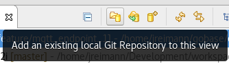
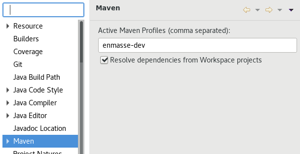

= Using the Eclipse IDE for working on EnMasse
:toc: macro
:toclevels: 2

ifdef::env-github[]
:tip-caption: :bulb:
:note-caption: :information_source:
:important-caption: :heavy_exclamation_mark:
:caution-caption: :fire:
:warning-caption: :warning:
endif::[]

This guide summarizes a few bits of information that should help you
work on EnMasse, when using Eclipse as an IDE.

toc::[]

== Install Eclipse

Pick a recent version. Installing it and run it.

Eclipse is offered in different editions. However those are only an
opinionated set of default plugins. So you can always add additional
plugins to get the same functionality.

I use the Eclipse installer, and install the ``Comitters Edition''.

You should at least have the following features installed:

  * JDT
  * M2E
  * eGit

You should also either run Eclipse with Java 11, or register Java 11.

== Additional core plugins

Adding a few plugins from the core release may be helpful. Open the "Help" -> "Install New Software…"
dialog, select the core release URL (e.g. for "2019-06" this is `http://download.eclipse.org/releases/2019-06`)
and install:

  * Docker

TIP: Disable the "Contact all software sites" checkbox to speed things
up and reduce the risk of download unaligned versions. 

== Importing the sources

The EnMasse repository contains go code, and the go language has very
specific requirement when it comes to the directory layout of its parent directories.
The source code must be checked out into a directory that has
`src/github.com/enmasseproject` as a direct parent, and the
repository must be checked out as `enmasse`. You can place this
construct wherever you want, but later on you must set the `GOPATH`
environment variables to this base location.

Assuming you put this into `/home/me/allmygo`, then the full path of
the repository must be `/home/me/allmygo/src/github.com/enmasseproject/enmasse`
and `GOPATH` needs to be set to `GOPATH=/home/me/allmygo`.

However all of that doesn’t matter with Eclipse, as you can simply
import the projects into your workspace. So the recommended way is to:

  * Clone the EnMasse repository into a go compatible directory layout as
explained above
  * Start Eclipse and create a new workspace
  * Import (not clone) the Git repository into the workspace +
    
  * Import all projects using the default import wizard
    ** Right mouse click on the Git repository
    ** Select ``Import projects …''
    ** Click ``Finish''

== Issue with `${maven.multiModuleProjectDirectory}`

Importing the project may result in an error per Java project with the
message of:

[source]
----
Properties could not be loaded from File: /home/me/allmygo/src/github.com/enmasseproject/enmasse/api-server/${maven.multiModuleProjectDirectory}/pom.properties (org.codehaus.mojo:properties-maven-plugin:1.0.0:read-project-properties:default:initialize)
----

EnMasse uses a multi-module Maven build, and uses `maven.multiModuleProjectDirectory` to
figure out the parent base module. However this approach might not always work, when not running
`mvn` from the command line.

Create a new profile in your global `~/.m2/settings.xml`, with the
following content:

.~/.m2/settings.xml
[source,xml]
----
<?xml version="1.0" encoding="UTF-8"?>
<settings xmlns="http://maven.apache.org/SETTINGS/1.0.0" xmlns:xsi="http://www.w3.org/2001/XMLSchema-instance" xsi:schemaLocation="http://maven.apache.org/SETTINGS/1.0.0 https://maven.apache.org/xsd/settings-1.0.0.xsd">
  <profiles>
    <profile>
      <id>enmasse-dev</id>
      <activation>
        <activeByDefault>false</activeByDefault>
      </activation>
      <properties>
        <maven.multiModuleProjectDirectory>/home/me/allmygo/src/github.com/enmasseproject/enmasse</maven.multiModuleProjectDirectory>
      </properties>
    </profile>
  </profiles>
</settings>
----

Then, enable this profile for each Eclipse project:

== Launch configurations

See the "launch configs" in link:launch/[launch/]  for a few helpful launchers. If
you have cloned and imported this repository into your workspace, then
those launch configurations should appear automatically in your "Run"
button.

== Code style & formatter

EnMasse doesn’t use a formal code style. So this is my approximation
of what I found: link:formatter.xml[formatter.xml].

NOTE: As there is no consistent code formatting or import ordering, I
would not turn on any "Save Actions" which re-format the code (you
might try the option to only format edited code):

However the following "Save Actions" have turned out to be useful:

  * Code Organizing
    ** Formatter
      *** Remove trailing whitespace: All lines
  * Unnecessary code
    ** Unused code
      *** Remove unused imports
    ** Unnecessary code
      *** Remove redundant semicolons

== Helpful plugins

The following additional plugins might help you:

[width="100%",options="header"]
|===
| Name | Description | Marketplace 
|*https://marketplace.eclipse.org/content/yedit[Yedit]* | A YAML Editor | http://marketplace.eclipse.org/marketplace-client-intro?mpc_install=949[]

|*https://marketplace.eclipse.org/content/shellwax[ShellWax]* | Shell script editor (requires Eclipse 2019-03) | http://marketplace.eclipse.org/marketplace-client-intro?mpc_install=4528322[]
|===

TIP: You can install them by directly dragging the button from this
page to your running Eclipse instance (assuming you have the Marketplace
client installed, which should be the default).